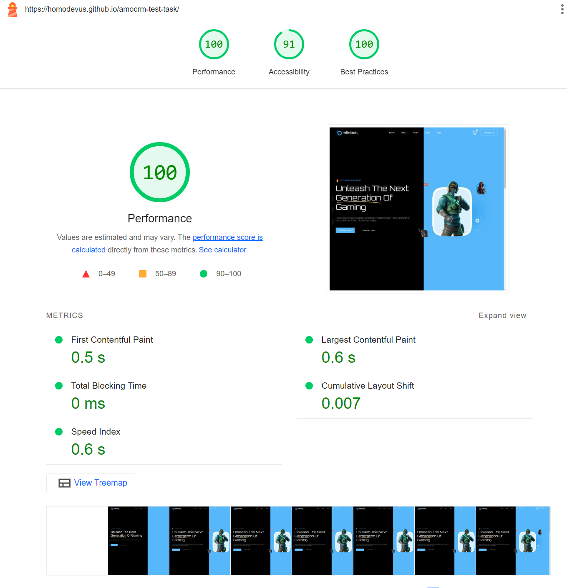

# Локальный запуск проекта

1. Установите зависимости с помощью команды `npm install`
2. Запустите проект с помощью команды `npm start`

# Команды

`npm install` - установка зависимостей

`npm start` - запустить проект локально

`npm run build` - собрать проект

`npm run deploy` - выложить проект на GitHub Pages

# Структура проекта

```
src
    components - React компоненты
        common - Глобальные компоненты
        sections - Блоки с контентом
    static
        images - Изображения
        fonts - Шрифты
```

# Lighthouse анализ


